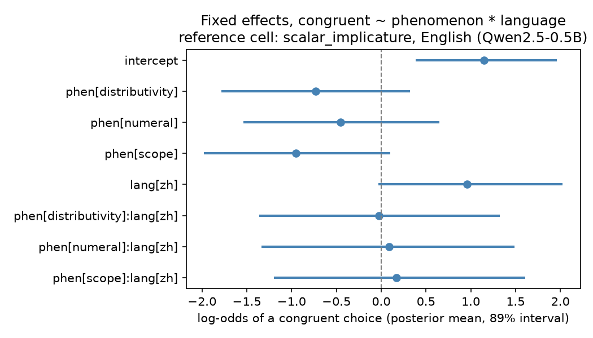

# enzh-quantifier-eval

A parallel English and Mandarin test suite for context-forced quantifier and
scalar interpretation, with a language model scoring harness and a Bayesian
hierarchical analysis.

## Motivation

Quantified sentences routinely underdetermine their interpretation. "Some of
the students passed" can convey that not all passed or merely that at least
some did. "Every member read a novel" leaves open whether the novels vary
with the members. Bare numerals and plural predication behave the same way.
Human listeners resolve these choices from context. This repository asks a
narrow, measurable question. When a context clearly forces one reading, does
a language model prefer a continuation that is congruent with that reading
over one that is congruent with the rival reading?

The suite is parallel across English and Mandarin, two typologically distant
languages that carve up the same interpretive space with different overt
means. Mandarin marks distributivity with 都 and largely fixes quantifier
scope by word order, while English leaves both unmarked in the test
sentences. Comparing the two arms therefore separates context-driven
disambiguation from the tracking of overt morphosyntactic cues. All items
were written natively in each language rather than translated.

## Background

The phenomena are classics of formal semantics and pragmatics. The
some-but-not-all inference is a Horn scalar implicature, and it is expected
to disappear in downward-entailing environments such as conditional
antecedents. Sentences of the form "every X verbed a Y" show quantifier
scope ambiguity between surface scope (the Ys vary) and inverse scope (one
shared Y). Bare numerals alternate between exact and at-least readings, most
visibly under lower-bound rules. Plural predication alternates between
collective and distributive construals. Each item pairs a context that
forces one reading with two continuations, one per reading, and records
which continuation the context supports.

## Dataset

`data/items.jsonl` contains 128 rows. There are 4 phenomena, 16 pairs per
phenomenon, and 2 languages per pair. Each row has these fields.

| field | description |
|---|---|
| pair_id | shared id of the EN and ZH versions of a scenario, e.g. `sc05` |
| item_id | unique row id, `pair_id` plus language, e.g. `sc05_zh` |
| language | `en` or `zh` |
| phenomenon | `scalar_implicature`, `scope`, `numeral`, or `distributivity` |
| context | discourse that forces one reading of the target |
| target | the sentence carrying the ambiguous or underspecified expression |
| cont_A | candidate continuation, single sentence |
| cont_B | candidate continuation, single sentence |
| forced | `A` or `B`, the continuation congruent with the forced reading |
| note | short design note for the item |

The congruent continuation sits in slot A for exactly half the pairs within
every phenomenon and language cell, so a scorer with a fixed slot preference
performs at chance. Continuations within a pair are length-matched (mean
absolute difference about 2.5 characters). Design decisions, including how
Mandarin scope rigidity and 都 were handled, are documented in
`data/DESIGN.md`. The items are author-curated and are pending a
native-speaker review pass. `data/human/README.md` gives the schema for a
planned human forced-choice baseline.

## Quickstart

Requires Python 3.13 on macOS or Linux. The first scoring run downloads
Qwen2.5-0.5B (about 1 GB) into the Hugging Face cache.

```bash
python3 -m venv .venv
.venv/bin/pip install -r requirements.txt
.venv/bin/python -m pytest tests/ -q
.venv/bin/python -m src.score --items data/items.jsonl --out results/scores.csv
.venv/bin/python -m src.summarise --scores results/scores.csv --out results/summary.md
.venv/bin/python analysis/run_analysis.py --scores results/scores.csv --outdir results
```

Scoring takes about two minutes on an Apple Silicon laptop (86 s for
Qwen2.5-0.5B on 128 items, 24 s for distilgpt2 on the 64 English items).
MCMC sampling takes a few seconds.

## Scoring method

For each item the model receives context plus target as a prefix and the
harness computes the summed log probability of each continuation. The
continuation with the higher score is the model's choice, and the choice is
congruent when it matches `forced`. Scoring uses plain base language model
probabilities with no chat template. `--normalise` switches to mean
per-token log probability. Models: `Qwen/Qwen2.5-0.5B` (primary, covers EN
and ZH) and `distilgpt2` (English-only sanity baseline, ZH rows skipped).

## Results

Chance is 50 percent by design. Accuracy is the percentage of items where
the model chose the context-congruent continuation. Each cell has 16 items.
These numbers come from the committed `results/scores.csv`, produced by the
commands above.

| phenomenon | language | Qwen2.5-0.5B | distilgpt2 |
|---|---|---|---|
| scalar_implicature | en | 81.2 | 50.0 |
| scalar_implicature | zh | 87.5 | not run |
| scope | en | 50.0 | 68.8 |
| scope | zh | 75.0 | not run |
| numeral | en | 62.5 | 62.5 |
| numeral | zh | 81.2 | not run |
| distributivity | en | 56.2 | 62.5 |
| distributivity | zh | 75.0 | not run |
| overall | | 71.1 | 60.9 |

Qwen2.5-0.5B is clearly above chance overall, strongest on scalar
implicature, and at chance on English scope, where the target string is
genuinely ambiguous. Its Mandarin accuracy exceeds its English accuracy on
scope and distributivity, which is expected because the Mandarin items mark
the forced reading overtly (fronted existential, 都). The 16 items per cell
make individual cell estimates noisy, which is what the hierarchical
analysis is for.

## Analysis

`analysis/run_analysis.py` fits a Bayesian hierarchical logistic regression
with PyMC on the Qwen rows only. The model is congruent ~ phenomenon *
language with a random intercept per pair (treatment coding, reference cell
scalar_implicature in English, 2 chains, 2000 draws after 1000 tuning steps,
all r_hat at 1.00). The posterior summary is in
`results/posterior_summary.csv`. The intercept is credibly positive (mean
1.15 log-odds, 89 percent interval 0.38 to 2.0), so the reference cell is
above chance. The Mandarin main effect is positive (mean 0.96) with an 89
percent interval that just includes zero, and the scope deficit relative to
scalar implicature (mean -0.95) is the largest phenomenon effect.



## Limitations

- The scored models are small base models. Results say nothing about
  instruction-tuned or frontier models.
- Items are author-curated and await an independent native-speaker review in
  both languages.
- There is no human baseline yet. The schema for one is in `data/human/`.
- Summed log probability is sensitive to continuation length. Continuations
  are length-matched within each pair to mitigate this, and the harness has a
  `--normalise` flag for mean per-token scoring.
- In the Mandarin scope and distributivity items the forced reading is
  overtly marked, because that is how Mandarin naturally expresses it. Those
  cells partly measure cue tracking rather than pure ambiguity resolution.
  See `data/DESIGN.md`.

## Layout

```
data/       items.jsonl, DESIGN.md, human/ (planned human baseline schema)
src/        score.py (LM scoring harness), summarise.py (accuracy tables)
analysis/   run_analysis.py (PyMC hierarchical logistic regression)
results/    scores.csv, summary.md, posterior_summary.csv, forest plot
tests/      dataset validation and scoring math tests
```

## License

Code is released under the MIT license. The dataset under `data/` is
released under CC-BY-4.0. Copyright (c) 2026 Herald Bao Di.
